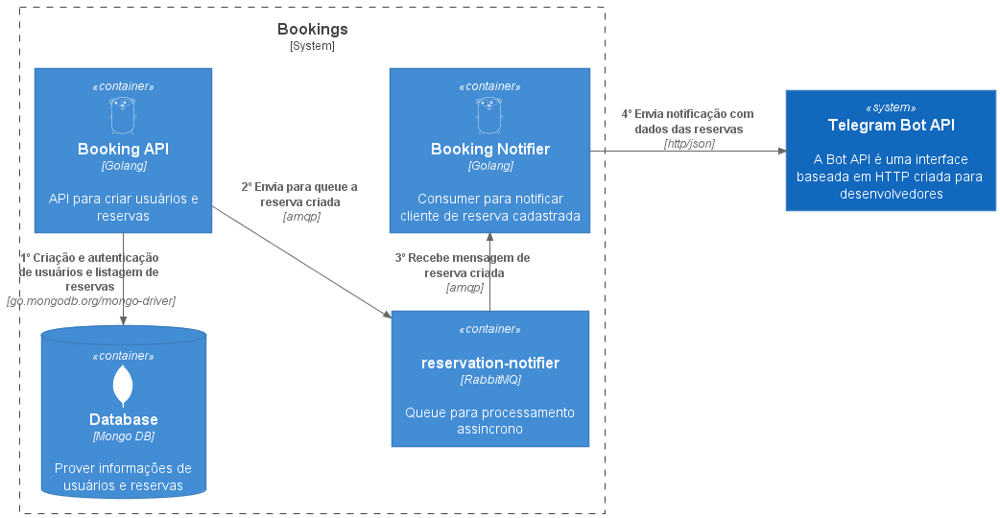

# Bookings 
Solução de cadastro de usuários e reservas.

### Tecnologias Utilizadas
1. [Golang](https://golang.org/)
2. [MongoDB](https://www.mongodb.com/)
3. [RabbitMQ](https://www.rabbitmq.com/getstarted.html)
4. [Github Actions](https://docs.github.com/pt/actions)
5. [Docker Hub](https://hub.docker.com/)
6. [Docker](https://www.docker.com/)
7. [Kubernetes](https://kubernetes.io/pt-br/)
8. [Digital Ocean](https://www.digitalocean.com/)
9. [Minikube](https://minikube.sigs.k8s.io/docs/start/)

### Desenho da Solução
<p align="center">
  
</p>

### Funcionalidades
1. Registrar Usuário
2. Autenticar Usuário
3. Criar Reservas por Usuário
4. Listar Reservas por Usuário

### Executar em ambiente local (Docker Compose)
Na raiz do projeto executar o seguinte comando: 
```
docker-compose up -d 
```

### Executar em ambiente local (Minikube)
1. Para iniciar o ambiente minikube (local)
   ```
   minikube start
   ```
2. Para aplicar os manifestos do k8s 
   ```
   kubectl apply -f .\.k8s\namespaces\ -R
   kubectl apply -f .\.k8s\deployments\ -R -n bookings
   kubectl apply -f .\.k8s\services\ -R -n bookings
   ```
3. Habilitar dashboard kubernetes 
   ```
   minikube dashboard
   ```
4. Habilitar portas dos serviços para utilizar localmente
   ```
   minikube service mongodb-service -n bookings
   minikube service rabbitmq-service -n bookings
   minikube service booking-api-service -n bookings
   ```
5. Alternando entre contextos 
   ```
   kubectl config get-contexts
   kubectl config use-context (nome do contexto)
   ```
6. Listando pods
   ```
   kubectl get pods -n bookings
   ```
7. Listando services
   ```
   kubectl get svc -n bookings
   ```
8. Listando hpa (HorizontalPodAutoscaler)
   ```
   kubectl get hpa -n bookings
   ```

### Postman (Collection)
https://www.getpostman.com/collections/e41fab194222bd5fc9c3 <br>
